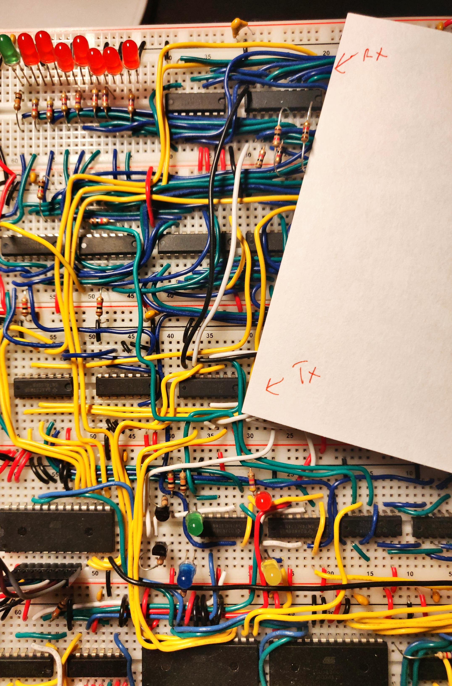

# Breadboard CPU

There's a novelty of creating a computer, however simplified, on breadboards.  You get to see all the LEDs firing, debug easily (?), and show it to anyone!  Who doesn't love flashy lights and lots of wires?

This is a single-instruction Harvard architecture 8-bit CPU.  It uses 16-bit addressing for memories.  There are 8 general-purpose registers, a stack pointer, and a program counter.

## ISA

To create a simple enough CPU that can still function, a custom ISA was created.

A summary is shown below, but the full ISA detail is shown on [Google Drive](https://docs.google.com/spreadsheets/d/1wT5JbnBH3hQDt6mVYworVms3PI7omDdNeonjpWtr__I/edit?usp=sharing) (as long as my NCSU Google Drive is still alive :) ).

### Summary:

* Math operations: add(i), and(i), or(i), not, cmp (subtraction and update status bits)
* Jumps (conditional and unconditional): call, ret, start, jmp, jo, jno, jz, jnz, js, jns, jc, jnc, trap
* Loads/stores: lea, ld, ldr, str, push, pop, stp(i) -- write device to output ports
* Special register manipulation: setsp, cpysp
* Debug: pause

## Programming

All versions of the assembler are retained for different ISA assembler versions.  Programs in `Programming/Programs` are example code using the commented version of the ISA/Assembler. 

## Hardware

Schematics were created using KiCAD, present in `KiCAD`.  It shall correspond to the hardware present on the actual breadboards.

### Hardware/Mixed-Signal Problems

Breadboards have no ground plane, which presents signal integrity problems (e.g. register being reset if ground voltage rises too high).

Shown is the ground line at the corner of the breadboard construction measured by an oscilloscope.  The magnitudes are likely incorrect because the ground lead was unconnected, but the relative magnitudes can explain the observed phenomena.

This can be mitigated by:
1. Installing a ground plane (expensive, inconvenient)
2. Joining the grounds of the transmit and receive ICs (have to fix for each problem register, can get messy)

The second option was taken and is shown below.

The result of this fix is a register that no longer randomly clears and a reduced ground bounce!

